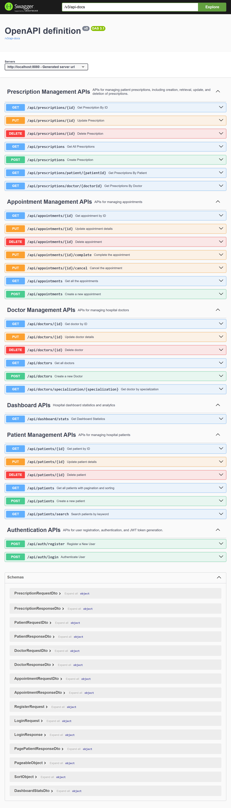
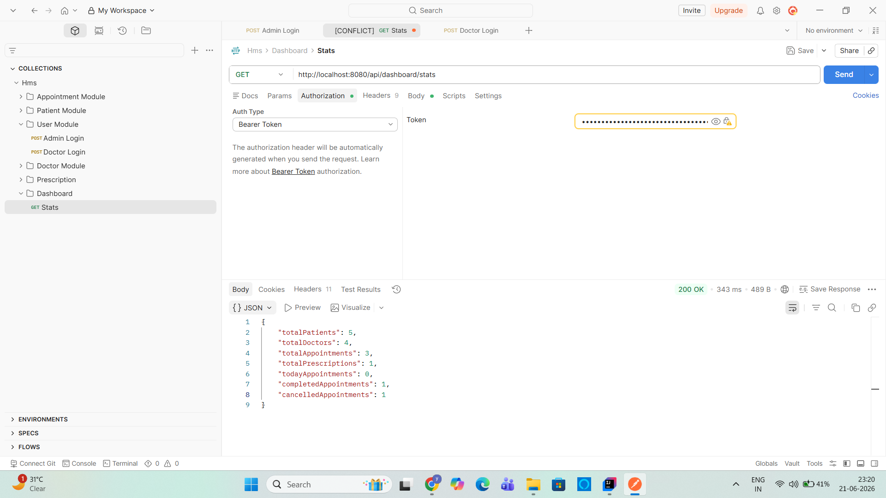

# 🏥 Hospital Management System (HMS)

A comprehensive Hospital Management System (HMS) backend application built using **Spring Boot**, **Spring Security**, **JWT Authentication**, **Spring Data JPA**, and **MySQL**.

This project provides secure REST APIs for managing patients, doctors, appointments, prescriptions, and dashboard statistics while implementing industry-standard backend development practices.

---

## 🚀 Features

### 🔐 Authentication & Authorization

* JWT Token Based Authentication
* Spring Security Integration
* Role-Based Access Control (RBAC)
* Secure REST APIs

### 👨‍⚕️ Doctor Management

* Create Doctor
* Get Doctor By ID
* Get All Doctors
* Update Doctor
* Delete Doctor
* Search Doctors By Specialization
* Role-Based Authorization

### 🧑 Patient Management

* Create Patient
* Get Patient By ID
* Get All Patients
* Update Patient
* Delete Patient
* Search Patients
* Pagination & Sorting Support

### 📅 Appointment Management

* Schedule Appointment
* Get Appointment Details
* Update Appointment
* Delete Appointment
* Complete Appointment
* Cancel Appointment
* Appointment Status Tracking

### 💊 Prescription Management

* Create Prescription
* Get Prescription By ID
* Get All Prescriptions
* Update Prescription
* Delete Prescription
* Search Prescriptions By Patient
* Search Prescriptions By Doctor
* Link Prescription With:

    * Patient
    * Doctor
    * Appointment

### 📊 Dashboard Module

* Total Patients Count
* Total Doctors Count
* Total Appointments Count
* Total Prescriptions Count
* Today's Appointments
* Completed Appointments
* Cancelled Appointments

### ⚙️ Additional Features

* DTO Pattern
* Global Exception Handling
* Custom Exceptions
* Validation Using Jakarta Validation
* Swagger/OpenAPI Documentation
* Pagination & Sorting
* Search APIs
* Clean Layered Architecture

---

## 🛠️ Tech Stack

### Backend

* Java 21
* Spring Boot 4
* Spring Security
* Spring Data JPA
* Hibernate ORM

### Database

* MySQL

### Authentication

* JWT (JSON Web Token)

### Build Tool

* Maven

### Documentation

* Swagger / OpenAPI

### Utilities

* Lombok

---

## 📁 Project Architecture

```text
Controller Layer
        ↓
Service Layer
        ↓
Repository Layer
        ↓
Database
```

### Architecture Overview

#### Controller Layer

Handles HTTP requests and responses.

#### Service Layer

Contains business logic and validations.

#### Repository Layer

Interacts with the database using Spring Data JPA.

#### DTO Layer

Transfers data between API and application layers.

#### Security Layer

Manages authentication and authorization using JWT and Spring Security.

---

## 🔑 Roles

### ADMIN

* Full Access
* Manage Patients
* Manage Doctors
* Manage Appointments
* Manage Prescriptions
* Access Dashboard

### DOCTOR

* View Patients
* Manage Prescriptions
* View Dashboard Data
* Manage Appointments

### RECEPTIONIST

* Register Patients
* Manage Appointments
* View Patient Records

---

## 📌 API Endpoints

### Authentication

```http
POST /api/auth/register
POST /api/auth/login
```

### Patients

```http
POST   /api/patients
GET    /api/patients
GET    /api/patients/{id}
PUT    /api/patients/{id}
DELETE /api/patients/{id}
GET    /api/patients/search
```

### Doctors

```http
POST   /api/doctors
GET    /api/doctors
GET    /api/doctors/{id}
PUT    /api/doctors/{id}
DELETE /api/doctors/{id}
GET    /api/doctors/specialization/{specialization}
```

### Appointments

```http
POST   /api/appointments
GET    /api/appointments
GET    /api/appointments/{id}
PUT    /api/appointments/{id}
DELETE /api/appointments/{id}

PUT    /api/appointments/{id}/complete
PUT    /api/appointments/{id}/cancel
```

### Prescriptions

```http
POST   /api/prescriptions
GET    /api/prescriptions
GET    /api/prescriptions/{id}
PUT    /api/prescriptions/{id}
DELETE /api/prescriptions/{id}

GET    /api/prescriptions/patient/{patientId}
GET    /api/prescriptions/doctor/{doctorId}
```

### Dashboard

```http
GET /api/dashboard/stats
```

---

## 🔄 Entity Relationships

### Prescription Relationships

```text
Prescription
    ↓
Patient

Prescription
    ↓
Doctor

Prescription
    ↓
Appointment
```

Implemented using:

```java
@ManyToOne
@JoinColumn(...)
```

---

## 📖 Swagger Documentation

After starting the application:

```text
http://localhost:8080/swagger-ui.html
```

or

```text
http://localhost:8080/swagger-ui/index.html
```

---

### Swagger UI Preview




### Dashboard Statistics API

Example response from the dashboard endpoint.



## ▶️ Running the Project

### Clone Repository

```bash
git clone https://github.com/Yash2930/hospital-management-system.git
```

### Navigate To Project

```bash
cd hospital-management-system
```

### Configure Database

Update:

```properties
application.properties
```

```properties
spring.datasource.url=jdbc:mysql://localhost:3306/hms
spring.datasource.username=root
spring.datasource.password=your_password
```

### Run Application

```bash
mvn spring-boot:run
```

---

## 🎯 Concepts Demonstrated

* Spring Boot REST APIs
* Spring Security
* JWT Authentication
* Role-Based Authorization
* DTO Pattern
* Pagination & Sorting
* Validation
* Exception Handling
* JPA Relationships
* Dashboard Reporting APIs
* Clean Architecture

---

## 🚀 Future Improvements

* Unit Testing using JUnit & Mockito
* Docker Containerization
* Cloud Deployment
* Appointment Refactoring Using Entity Relationships
* Billing Module
* Medical History Module
* Audit Logging
* Notification Service (Email/SMS)

---

## 👨‍💻 Author

**Yashwardhan Singh Rathore**

Associate Programmer | Java Backend Developer

Currently focused on:

* Java
* Spring Boot
* Spring Security
* REST APIs
* Microservices
* DSA & System Design

---

⭐ If you found this project useful, consider giving it a star.
